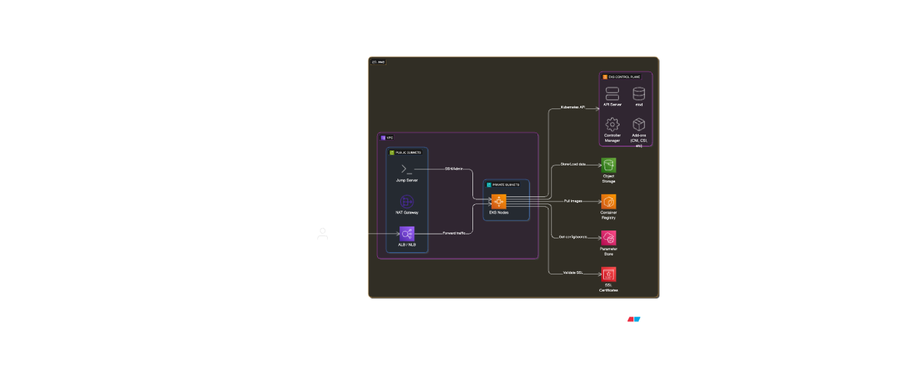

# EKS Microservices Platform - Terraform Infrastructure

A production-ready Terraform infrastructure for deploying microservices on Amazon EKS with comprehensive security, monitoring, and automation capabilities.

## Architecture Overview



```
┌─────────────────────────────────────────────────────────────────────────────────┐
│                                AWS Cloud                                        │
├─────────────────────────────────────────────────────────────────────────────────┤
│                                                                                 │
│  ┌─────────────────────────────────────────────────────────────────────────┐  │
│  │                              VPC Network                                │  │
│  │  ┌─────────────────┐                   ┌─────────────────────────────┐  │  │
│  │  │ Public Subnets  │                   │    Private Subnets          │  │  │
│  │  │                 │                   │                             │  │  │
│  │  │ • ALB           │ ────────────────> │ • EKS Worker Nodes          │  │  │
│  │  │ • NAT Gateway   │                   │ • Main API Service          │  │  │
│  │  │ • Internet GW   │                   │ • Auxiliary Service         │  │  │
│  │  │                 │                   │ • ArgoCD (Optional)         │  │  │
│  │  └─────────────────┘                   └─────────────────────────────┘  │  │
│  └─────────────────────────────────────────────────────────────────────────┘  │
│                                                                                 │
│  ┌─────────────────────────────────────────────────────────────────────────┐  │
│  │                         EKS Control Plane                              │  │
│  │  • Managed Kubernetes API                                              │  │
│  │  • etcd, scheduler, controller-manager                                 │  │
│  │  • Private/Public endpoint access                                      │  │
│  └─────────────────────────────────────────────────────────────────────────┘  │
│                                                                                 │
│  ┌─────────────────────────────────────────────────────────────────────────┐  │
│  │                        Supporting Services                              │  │
│  │  ┌─────────────┐  ┌─────────────┐  ┌─────────────┐  ┌─────────────────┐  │  │
│  │  │     S3      │  │ Parameter   │  │    ECR      │  │  ACM Certs      │  │  │
│  │  │  • Buckets  │  │   Store     │  │ • Repos     │  │ • SSL/TLS       │  │  │
│  │  │  • Assets   │  │ • Config    │  │ • Images    │  │ • Auto-validate │  │  │
│  │  └─────────────┘  └─────────────┘  └─────────────┘  └─────────────────┘  │  │
│  └─────────────────────────────────────────────────────────────────────────┘  │
│                                                                                 │
│  ┌─────────────────────────────────────────────────────────────────────────┐  │
│  │                      Security & Access                                 │  │
│  │  • Security Groups with least privilege                                │  │
│  │  • IRSA (IAM Roles for Service Accounts)                              │  │
│  │  • GitHub OIDC for CI/CD                                              │  │
│  │  • Network ACLs and encryption                                        │  │
│  └─────────────────────────────────────────────────────────────────────────┘  │
└─────────────────────────────────────────────────────────────────────────────────┘
```

## Infrastructure Components

### Core Infrastructure

- **VPC**: Multi-AZ network with public/private subnets
- **EKS Cluster**: Managed Kubernetes with configurable endpoint access
- **Node Groups**: Auto-scaling worker nodes with instance store optimization
- **Security Groups**: Least-privilege network access controls

### Storage & Configuration

- **S3 Buckets**: Versioned buckets for application assets
- **Parameter Store**: Centralized configuration management
- **ECR Repositories**: Container image storage with lifecycle policies

### Security & Networking

- **ACM Certificates**: Automated SSL/TLS certificate management
- **IRSA**: IAM Roles for Service Accounts with GitHub OIDC
- **Load Balancer Controller**: AWS ALB integration for Kubernetes

### Optional Components

- **ArgoCD**: GitOps continuous deployment
- **Metrics Server**: Resource usage monitoring
- **Cluster Autoscaler**: Automatic node scaling

## Quick Start

### Prerequisites

- AWS CLI configured with appropriate permissions
- Terraform >= 1.0
- kubectl
- Valid domain name for SSL certificates

### 1. Setup Terraform Backend

```bash
# Configure backend variables (optional)
export BUCKET_NAME="my-terraform-state-bucket-unique-name"
export DYNAMODB_TABLE="terraform-locks"
export REGION="us-west-2"

# Create S3 bucket and DynamoDB table for state management
./scripts/setupbackend.sh
```

### 2. Configure Variables

Create your configuration in AWS Secrets Manager:

```bash
# Store terraform.tfvars in AWS Secrets Manager
aws secretsmanager create-secret \
  --name "terraform.tfvars" \
  --description "Terraform variables for EKS infrastructure" \
  --secret-string file://terraform.tfvars \
  --region us-west-2
```

**Example `terraform.tfvars`:**

```hcl
# General Configuration
aws_region = "us-west-2"
general_tags = {
  Environment = "dev"
  Owner      = "platform-team"
  Project    = "microservices"
  Team       = "infrastructure"
  ManagedBy  = "terraform"
}

# Network Configuration
network = {
  cidr_block        = "10.0.0.0/16"
  Azs              = ["us-west-2a", "us-west-2b", "us-west-2c"]
  private_subnet   = ["10.0.1.0/24", "10.0.2.0/24", "10.0.3.0/24"]
  public_subnet    = ["10.0.101.0/24", "10.0.102.0/24", "10.0.103.0/24"]
  create_default_sg = false
}

# EKS Cluster
cluster = {
  name                     = "microservices"
  version                  = "1.28"
  enable_encryption        = true
  enable_cluster_log_types = ["api", "audit", "authenticator"]
  log_retention_in_days    = 7
  kms_key_deletion_window  = 7
}

cluster_network = {
  endpoint_private_access = true
  endpoint_public_access  = true
  public_access_cidrs    = ["0.0.0.0/0"]  # Restrict to your IPs
}

# Node Groups
eks_node_groups_config = {
  node_groups = {
    general = {
      desired_capacity = 2
      max_capacity     = 4
      min_capacity     = 1
      instance_types   = ["t3.medium"]
      capacity_type    = "ON_DEMAND"
      disk_size        = 20
      disk_type        = "gp3"
      k8s_labels = {
        role = "general"
      }
    }
  }
  settings = {
    enable_monitoring = true
    enable_imdsv2     = true
    name_prefix       = ""
    name_suffix       = ""
  }
}

# SSL Certificate
ssl_certificate = {
  domain_name               = "api.yourdomain.com"
  subject_alternative_names = ["*.api.yourdomain.com"]
}

# GitHub OIDC Configuration
irsa_config = {
  github_org                  = "your-github-org"
  main_api_repo_name          = "main-api"
  auxiliary_service_repo_name = "auxiliary-service"
}

# S3 Buckets
s3_buckets = {
  "app-assets" = {
    versioning = true
    encryption = true
  }
}

# Parameters
parameters = {
  "database/host" = {
    type        = "String"
    value       = "db.example.com"
    description = "Database host"
  }
  "api/secret" = {
    type        = "SecureString"
    value       = "super-secret-key"
    description = "API secret key"
  }
}
```

### 3. Deploy Infrastructure

```bash
# Deploy with automatic approval
./scripts/setup-terraform.sh

# Or deploy with manual approval
terraform init
terraform plan -var-file=<(aws secretsmanager get-secret-value \
  --secret-id "terraform.tfvars" \
  --region us-west-2 \
  --query 'SecretString' \
  --output text)
terraform apply
```

### 4. Configure kubectl

```bash
# Configure kubectl to connect to your new cluster
aws eks --region us-west-2 update-kubeconfig --name dev-microservices-microservices-cluster
```

### 5. Verify Deployment

```bash
# Check cluster status
kubectl get nodes

# Check installed components
kubectl get pods -A

# Verify certificate (if auto-validation enabled)
kubectl get certificate -A
```

## Project Structure

```tree
.
├── main.tf                    # Root module orchestration
├── variables.tf               # Input variable definitions
├── outputs.tf                 # Output value definitions
├── providers.tf              # Provider configurations
├── backend.tf                # Terraform backend config (auto-generated)
├── iam.tf                    # EBS CSI driver IAM configuration
├── ecr.tf                    # ECR repositories
├── scripts/                  # Automation scripts
│   ├── setupbackend.sh       # Backend S3/DynamoDB creation
│   ├── setup-terraform.sh    # Deploy infrastructure
│   ├── destroy-terraform.sh  # Destroy infrastructure
│   └── destroy-backend.sh    # Remove backend resources
├── modules/                  # Terraform modules
│   ├── vpc/                  # VPC and networking
│   ├── security-groups/      # Security group management
│   ├── eks-cluster/          # EKS control plane
│   ├── eks-node-groups/      # EKS worker nodes
│   ├── eks-addons/           # EKS add-ons
│   ├── s3/                   # S3 bucket creation
│   ├── parameter-store/      # SSM Parameter Store
│   ├── ssl-certificates/     # ACM certificate management
│   ├── irsas/                # IRSA and GitHub OIDC
│   └── k8s-resources/        # Kubernetes resources
└── jsons/                    # Policy documents
    └── aws-load-balancer-policy.json
```

## Module Overview

| Module | Purpose | Key Features |
|--------|---------|--------------|
| `vpc` | Network foundation | Multi-AZ, public/private subnets, NAT gateway |
| `security-groups` | Network security | Least-privilege rules, EKS-optimized |
| `eks-cluster` | Kubernetes control plane | Encryption, logging, OIDC provider |
| `eks-node-groups` | Worker nodes | Auto-scaling, multiple instance types |
| `eks-addons` | Cluster add-ons | EBS CSI, CoreDNS, kube-proxy, VPC CNI |
| `s3` | Object storage | Versioning, encryption, lifecycle policies |
| `parameter-store` | Configuration | Encrypted parameters, hierarchical structure |
| `ssl-certificates` | TLS certificates | Auto-validation, SAN support |
| `irsas` | Authentication | GitHub OIDC, service account roles |
| `k8s-resources` | Kubernetes components | Metrics server, autoscaler, ArgoCD |

## Security Features

### Network Security

- **Private Subnets**: Worker nodes isolated from internet
- **Security Groups**: Least-privilege access controls
- **Endpoint Access**: Configurable public/private API access

### Identity and Access Management

- **IRSA**: IAM roles for Kubernetes service accounts
- **GitHub OIDC**: Secure CI/CD without long-term credentials
- **Least Privilege**: Minimal permissions for each component

### Data Protection

- **Encryption**: EKS secrets, S3 buckets, Parameter Store
- **TLS Certificates**: Automated SSL/TLS management
- **Network Isolation**: Private networking with controlled egress

## Operational Features

### Monitoring and Observability

- **Metrics Server**: Resource usage monitoring
- **CloudWatch Integration**: Centralized logging
- **Prometheus Ready**: Metrics collection endpoints

### Automation and Scaling

- **Cluster Autoscaler**: Automatic node scaling
- **Horizontal Pod Autoscaler**: Application scaling
- **GitOps Ready**: ArgoCD integration

### High Availability

- **Multi-AZ Deployment**: Cross-availability zone redundancy
- **Auto Scaling Groups**: Self-healing infrastructure
- **Load Balancing**: AWS ALB integration

## Advanced Configuration

### Custom Node Groups

```hcl
eks_node_groups_config = {
  node_groups = {
    # General purpose nodes
    general = {
      desired_capacity = 2
      max_capacity     = 10
      min_capacity     = 1
      instance_types   = ["t3.medium", "t3.large"]
      capacity_type    = "SPOT"
      k8s_labels = {
        role = "general"
        "node.kubernetes.io/instance-type" = "mixed"
      }
      k8s_taints = [{
        key    = "spot-instance"
        value  = "true"
        effect = "NO_SCHEDULE"
      }]
    }
    
    # High memory nodes for specific workloads
    memory_optimized = {
      desired_capacity = 1
      max_capacity     = 3
      min_capacity     = 0
      instance_types   = ["r5.large"]
      capacity_type    = "ON_DEMAND"
      k8s_labels = {
        role = "memory-intensive"
      }
    }
  }
}
```

### ArgoCD Configuration

```hcl
k8s_resources_config = {
  install_argocd = true
  argocd_config = {
    server_service_type   = "LoadBalancer"
    enable_metrics        = true
    ha_enabled            = true
    enable_applicationset = true
    create_app_of_apps    = true
  }
}
```

## Deployment Workflows

### GitHub Actions Integration

The infrastructure creates OIDC providers and IAM roles for GitHub Actions. Use these in your workflows:

```yaml
name: Deploy to EKS
on:
  push:
    branches: [main]

jobs:
  deploy:
    runs-on: ubuntu-latest
    permissions:
      id-token: write
      contents: read
    
    steps:
    - uses: actions/checkout@v4
    
    - name: Configure AWS credentials
      uses: aws-actions/configure-aws-credentials@v4
      with:
        role-to-assume: ${{ secrets.AWS_ROLE_ARN_MAIN }}
        aws-region: ${{ secrets.AWS_REGION }}
    
    - name: Login to ECR
      id: login-ecr
      uses: aws-actions/amazon-ecr-login@v2
    
    - name: Build and push Docker image
      env:
        ECR_REGISTRY: ${{ steps.login-ecr.outputs.registry }}
        ECR_REPOSITORY: ${{ secrets.ECR_REPOSITORY_MAIN }}
        IMAGE_TAG: ${{ github.sha }}
      run: |
        docker build -t $ECR_REGISTRY/$ECR_REPOSITORY:$IMAGE_TAG .
        docker push $ECR_REGISTRY/$ECR_REPOSITORY:$IMAGE_TAG
```

## Management Operations

### Scaling Operations

```bash
# Scale node group
aws eks update-nodegroup-config \
  --cluster-name dev-microservices-microservices-cluster \
  --nodegroup-name general \
  --scaling-config minSize=2,maxSize=8,desiredSize=4

# Scale deployments
kubectl scale deployment main-api --replicas=3
```

### Certificate Management

```bash
# Check certificate status
aws acm list-certificates --region us-west-2

# Describe certificate validation
aws acm describe-certificate \
  --certificate-arn arn:aws:acm:us-west-2:account:certificate/cert-id
```

### Troubleshooting

```bash
# Check cluster health
kubectl get nodes
kubectl get pods -A

# EKS cluster logs
aws logs describe-log-groups --log-group-name-prefix /aws/eks/

# Node group issues
kubectl describe nodes
kubectl get events --sort-by=.metadata.creationTimestamp
```

## Cleanup

### Destroy Infrastructure

```bash
# Destroy all resources
./scripts/destroy-terraform.sh

# Remove backend (optional - destroys state storage)
./scripts/destroy-backend.sh
```

## Improvements and Future Enhancements

### Recommended Improvements

1. **Jump Server Setup**
   - Deploy bastion host in public subnet for secure cluster access
   - Configure internal-only EKS API endpoint for enhanced security
   - Implement session manager for audit logging

2. **CI/CD Pipeline Integration**
   - Implement GitOps workflows with ArgoCD
   - Add automated testing in deployment pipelines
   - Configure blue-green deployment strategies

3. **Enhanced Configuration Management**
   - Migrate from AWS Secrets Manager to dedicated tfvars management
   - Implement environment-specific variable files
   - Add configuration validation and drift detection

4. **Advanced Monitoring**
   - Deploy Prometheus and Grafana stack
   - Implement distributed tracing with AWS X-Ray
   - Add custom metrics and alerting rules

5. **Disaster Recovery**
   - Implement cross-region backup strategies
   - Add automated cluster snapshots
   - Configure multi-region failover procedures

## Limitations and Considerations

### Current Limitations

1. **Security Constraints**
   - EKS API endpoint currently public (should be private with jump server)
   - No WAF integration for additional application security
   - Limited network segmentation for microservices

2. **Operational Gaps**
   - Manual certificate DNS validation required
   - No automated backup and restore procedures
   - Limited cost optimization features

3. **Scalability Considerations**
   - Single cluster design (consider multi-cluster for large scale)
   - No advanced networking (service mesh) implementation
   - Basic monitoring and alerting setup

4. **Development Workflow**
   - Manual terraform.tfvars management in Secrets Manager
   - No environment promotion automation
   - Limited testing infrastructure

### Production Readiness Checklist

- [ ] Configure private EKS endpoint with jump server
- [ ] Implement comprehensive monitoring stack
- [ ] Set up automated backup procedures
- [ ] Configure disaster recovery procedures
- [ ] Add WAF and additional security layers
- [ ] Implement proper cost monitoring and optimization
- [ ] Set up automated testing infrastructure
- [ ] Configure proper logging aggregation
- [ ] Implement network policies and service mesh
- [ ] Add compliance and audit logging

## Contributing

1. Follow Terraform best practices and module standards
2. Update documentation for any configuration changes
3. Test changes in development environment before production
4. Use conventional commit messages for infrastructure changes
5. Ensure security reviews for any network or IAM changes

## License

This infrastructure code is provided under the MIT License. See LICENSE file for details.
